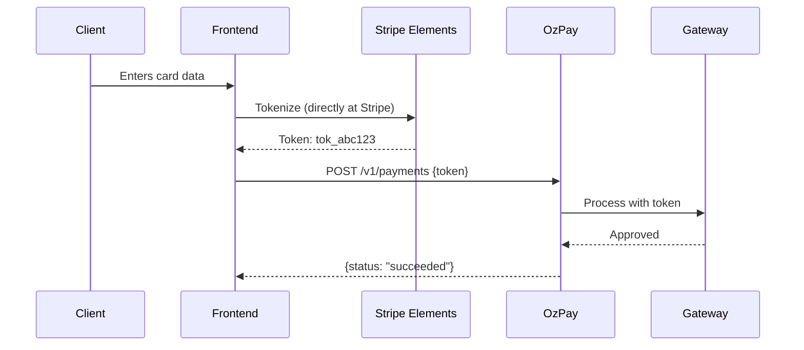
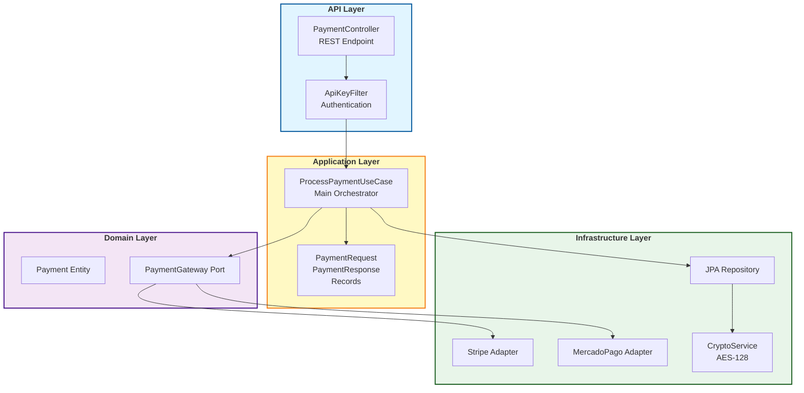
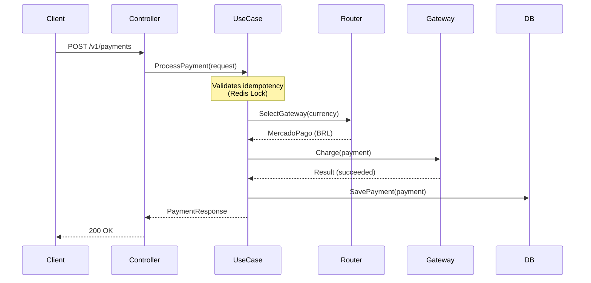
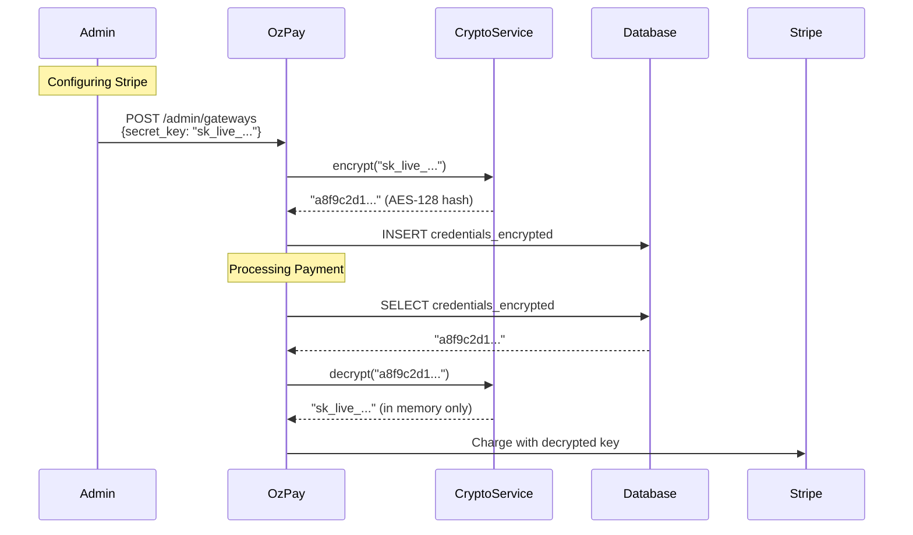

# OzPay

**Intelligent Payment Orchestration for Brazil + Global Markets**

[](https://opensource.org/licenses/MIT)
[](https://openjdk.java.net/)
[](https://spring.io/projects/spring-boot)

> Accept PIX + Stripe with a single API. No vendor lock-in. No PCI-DSS headaches.

---

## Table of Contents

- [The Problem We Solve](#the-problem-we-solve)
- [Solution Overview](#solution-overview)
- [Key Features](#key-features)
- [Architecture](#architecture)
- [Quick Start](#quick-start)
- [Usage Examples](#usage-examples)
- [Security](#security)
- [Technology Stack](#technology-stack)
- [Development Roadmap](#development-roadmap)
- [Testing](#testing)
- [Contributing](#contributing)
- [License](#license)
- [Contact](#contact)

---

## The Problem We Solve

If you sell courses, SaaS, or digital products, you face this challenge:

- **Stripe is excellent for USD/EUR**, but lacks native PIX support
- **MercadoPago/PagSeguro have PIX**, but are weak internationally
- **Integrating both manually** = 2x work, 2x bugs, 2x maintenance

**Result:** You lose ~30% of Brazilian sales (no PIX) or lose international sales (no Stripe).

### The OzPay Solution

One integration. Multiple gateways. Zero code duplication.

```javascript
// Single backend code for any gateway
ozpay.charge({
  amount: 197,
  currency: "BRL",  // Routes to MercadoPago (PIX)
  customer: { email: "cliente@example.com" }
})

ozpay.charge({
  amount: 197,
  currency: "USD",  // Routes to Stripe (international card)
  customer: { email: "customer@example.com" }
})
```

---

## Key Features

### Zero-Touch Security

**We never touch card data** - PCI-DSS compliance is the gateway's problem, not yours.



**Benefits:**

| Benefit | Impact |
|---------|---------|
| No PCI-DSS certification | Save $50k+/year |
| No sensitive data leakage risk | Reduced liability |
| Simple infrastructure | No HSM, banking firewall, etc. |

### Brazil + Global Specialization

| Payment Method | Gateway | Typical Conversion |
|----------------|---------|-------------------|
| PIX | MercadoPago | ~85% |
| Boleto | MercadoPago | ~60% |
| Brazilian Card | MercadoPago | ~70% |
| International Card | Stripe | ~80% |

**Automatic routing by currency/country** - no manual selection needed.

### Hardcore Resilience

- **Idempotency**: Same request twice = same response (prevents double-charge)
- **Smart Retry**: Failed due to timeout? Retries with backoff
- **Circuit Breaker**: Unstable gateway? Automatically isolates
- **Failover** (roadmap): If Gateway A fails, tries Gateway B

### Total Observability

```promql
# Approval rate by gateway (Prometheus)
sum(rate(ozpay_payments_succeeded[5m])) by (gateway)
/ 
sum(rate(ozpay_payments_total[5m])) by (gateway)
```

- Real-time Grafana dashboards
- P50/P95/P99 latency per gateway
- Auditable history of all decisions

---

## Architecture

OzPay follows **Clean Architecture** with clear separation between layers:



### Transaction Flow



---

## Quick Start

### Prerequisites

- Java 21
- Docker + Docker Compose
- Maven 3.8+

### Installation

```bash
# 1. Clone the repository
git clone https://github.com/vitinh0z/oz-pay.git
cd oz-pay

# 2. Start dependencies (PostgreSQL + Redis)
docker-compose up -d

# 3. Configure environment variables
cp .env.example .env
# Edit .env and add your gateway keys

# 4. Run the application
./mvnw spring-boot:run
```

The API will be available at `http://localhost:8080`

---

## Usage Examples

### Complete Example (PIX in Brazil)

**1. Frontend tokenizes (if needed)**
```html
<!-- For cards, use Stripe Elements (example) -->
<script src="https://js.stripe.com/v3/"></script>
<script>
  const stripe = Stripe('pk_test_...');
  const {token} = await stripe.createToken(cardElement);
  // token.id = "tok_visa_abc123"
</script>
```

**2. Backend processes via OzPay**
```bash
curl -X POST http://localhost:8080/v1/payments \
  -H "Content-Type: application/json" \
  -H "X-OzPay-Key: ozp_test_abc123def456" \
  -H "Idempotency-Key: unique-order-789" \
  -d '{
    "amount": 197.00,
    "currency": "BRL",
    "paymentMethod": {
      "type": "pix"
    },
    "customer": {
      "id": "cust_001",
      "email": "cliente@exemplo.com",
      "document": "12345678900"
    },
    "metadata": {
      "order_id": "order_999",
      "product": "Advanced Java Course"
    }
  }'
```

**3. Response (PIX generated)**
```json
{
  "id": "ozp_pay_xyz789",
  "status": "pending",
  "amount": 197.00,
  "currency": "BRL",
  "gateway": {
    "provider": "mercadopago",
    "transaction_id": "12345678901"
  },
  "pix": {
    "qr_code": "00020126580014br.gov.bcb.pix...",
    "qr_code_url": "https://chart.googleapis.com/chart?chs=300x300&cht=qr&chl=...",
    "expires_at": "2026-01-17T16:30:00Z"
  },
  "created_at": "2026-01-17T16:00:00Z"
}
```

**4. Client pays PIX**
- Scans QR Code or copies code
- Pays in banking app

**5. Webhook updates status**
```bash
# OzPay receives webhook from MercadoPago
POST /webhooks/mercadopago
# Updates payment.status: pending → succeeded

# OzPay sends normalized webhook to you (roadmap)
POST https://your-site.com/webhooks/ozpay
{
  "event": "payment.completed",
  "payment_id": "ozp_pay_xyz789",
  "status": "succeeded"
}
```

### Example with International Card

```bash
curl -X POST http://localhost:8080/v1/payments \
  -H "X-OzPay-Key: ozp_test_abc123" \
  -H "Idempotency-Key: unique-order-790" \
  -d '{
    "amount": 197.00,
    "currency": "USD",
    "paymentMethod": {
      "type": "card_token",
      "token": "tok_visa_stripe_abc123"
    },
    "customer": {
      "email": "customer@example.com"
    }
  }'
```

**Response (immediate approval)**
```json
{
  "id": "ozp_pay_abc456",
  "status": "succeeded",
  "amount": 197.00,
  "currency": "USD",
  "gateway": {
    "provider": "stripe",
    "transaction_id": "ch_abc123def456"
  },
  "created_at": "2026-01-17T16:05:00Z",
  "execution_time_ms": 234
}
```

---

## Security

### How Gateway Credentials Are Stored



**Security Features:**

| Feature | Description |
|---------|-------------|
| Encryption at Rest | Credentials never stored in plain text in database |
| Isolation | Tenant A cannot access Tenant B's credentials |
| Master Key Rotation | Supports annual master key rotation |
| Zero Logs | Keys never appear in logs (masked) |

---

## Technology Stack

| Layer | Technology | Version |
|-------|-----------|---------|
| Runtime | Java | 21 |
| Framework | Spring Boot | 3.x |
| Architecture | Clean Architecture | - |
| Database | PostgreSQL | 16 |
| Cache & Lock | Redis | 7 |
| Resilience | Resilience4j | Latest |
| Observability | Prometheus + Grafana | - |
| Validation | Bean Validation | Jakarta |
| Build | Maven | 3.8+ |

---

## Development Roadmap

### Completed

| Phase | Description | Status |
|-------|-------------|--------|
| Phase 0 | Foundation (Spring Boot 3 + Clean Architecture) | ✓ Complete |
| Phase 1 | Domain Model (Payment Entity, Value Objects) | ✓ Complete |
| Phase 2 | Application Layer (Nested DTOs, Records, Mappers) | ✓ Complete |
| Phase 4 | Security (AES-128 Encryption, GatewayConfig) | ✓ Complete |

### In Progress

| Phase | Task | Status |
|-------|------|--------|
| Phase 3 | Infrastructure Basics | In Progress |
| | JPA Persistence | ✓ Done |
| | PaymentController REST | ✓ Done |
| | FakeGateway (testing) | Pending |
| | Real Stripe Integration | Pending |
| | Real MercadoPago Integration | Pending |

### Next Phases

**Phase 5: Multi-Tenancy**
- ApiKeyFilter
- ThreadLocal Context
- Row-level security (tenant_id)

**Phase 6: Resilience**
- Redis configured ✓
- Distributed Lock (idempotency)
- Circuit Breaker
- Retry with Exponential Backoff

**Phase 7: Observability**
- Prometheus + Grafana
- Spring Actuator Metrics
- Latency Dashboard

**Phase 8: Production**
- Swagger/OpenAPI
- Deployment Scripts
- Complete Documentation

---

## Business Model (Future)

OzPay will be commercialized as **SaaS** (OzPay.app), but with **open-source** code.

### Planned Pricing

| Tier | Price | Transactions/month | Gateways | Support |
|------|-------|-------------------|----------|---------|
| **Free** | $0 | 100 | 1 | Docs |
| **Starter** | $29 | 1,000 | 2 | Email |
| **Growth** | $99 | 5,000 | Unlimited | Priority |
| **Enterprise** | Custom | Unlimited | Unlimited | Dedicated |

### Why Open-Source + SaaS?

| Reason | Benefit |
|--------|---------|
| **Transparency** | Clients can audit the code processing their payments |
| **Zero Vendor Lock-in** | Can self-host if desired |
| **Community** | Contributions improve the product for everyone |
| **Trust** | Payments are too sensitive to be a "black box" |

---

## Testing

```bash
# Unit tests (without Spring Context)
./mvnw test

# Integration tests (with PostgreSQL)
./mvnw verify -P integration-tests

# Coverage report
./mvnw jacoco:report
# Report in: target/site/jacoco/index.html
```

### Test Data (Sandbox)

**Cards that work in any OzPay gateway:**

| Card Type | Number | Result |
|-----------|--------|--------|
| Visa (Approved) | 4242 4242 4242 4242 | Success |
| Mastercard (Approved) | 5555 5555 5555 4444 | Success |
| Declined (Insufficient Funds) | 4000 0000 0000 9995 | Declined |
| Timeout (for retry testing) | 4000 0000 0000 3220 | Timeout |

**Additional details:**
- CVV: any 3 digits
- Expiry: any future date

---

## Contributing

Contributions are **very welcome**! This is a true open-source project.

### How to Contribute

1. Fork the project
2. Create a branch: `git checkout -b feature/my-feature`
3. Commit: `git commit -m 'feat: add PayPal support'`
4. Push: `git push origin feature/my-feature`
5. Open a Pull Request

### Guidelines

| Guideline | Description |
|-----------|-------------|
| Architecture | Maintain Clean Architecture (Domain/Application/Infrastructure) |
| Testing | Write unit tests (coverage > 80%) |
| Code Style | Follow Google Java Style Guide |
| Documentation | Document public APIs with Javadoc |
| Commits | Use Conventional Commits (`feat:`, `fix:`, `docs:`, etc) |

### Good First Issues

Look for labels:
- `good first issue` - Ideal for first contribution
- `help wanted` - We need help here
- `documentation` - Documentation improvements

---

## Project Status

| Metric | Status |
|--------|--------|
| Build |  |
| Coverage |  |
| Version |  |
| Open Issues |  |

**Currently Implemented:**

- Clean and testable architecture
- Robust domain model
- JPA persistence
- Credential encryption
- Type-safe DTOs with Records

**In Development:**

- Real gateway integrations
- Complete multi-tenancy
- Resilience (retry, circuit breaker)

---

## License

This project is licensed under the **MIT License with Attribution**.

### What This Means

You can:
- ✓ Use commercially
- ✓ Modify the code
- ✓ Distribute copies
- ✓ Create derivative products

**Requirements:**
- Must include original copyright notice
- Must include license text
- Must provide attribution to the original project

### Full License Text

```
MIT License with Attribution

Copyright (c) 2026 Victor (vitinh0z)

Permission is hereby granted, free of charge, to any person obtaining a copy
of this software and associated documentation files (the "Software"), to deal
in the Software without restriction, including without limitation the rights
to use, copy, modify, merge, publish, distribute, sublicense, and/or sell
copies of the Software, and to permit persons to whom the Software is
furnished to do so, subject to the following conditions:

The above copyright notice and this permission notice shall be included in all
copies or substantial portions of the Software.

THE SOFTWARE IS PROVIDED "AS IS", WITHOUT WARRANTY OF ANY KIND, EXPRESS OR
IMPLIED, INCLUDING BUT NOT LIMITED TO THE WARRANTIES OF MERCHANTABILITY,
FITNESS FOR A PARTICULAR PURPOSE AND NONINFRINGEMENT. IN NO EVENT SHALL THE
AUTHORS OR COPYRIGHT HOLDERS BE LIABLE FOR ANY CLAIM, DAMAGES OR OTHER
LIABILITY, WHETHER IN AN ACTION OF CONTRACT, TORT OR OTHERWISE, ARISING FROM,
OUT OF OR IN CONNECTION WITH THE SOFTWARE OR THE USE OR OTHER DEALINGS IN THE
SOFTWARE.

Attribution Requirement:
Any use of this software in a product or service must include a visible 
attribution to "OzPay by vitinh0z" in the product documentation, website 
footer, or credits section.
```

See [LICENSE](LICENSE) for complete details.

---

## Acknowledgments

| Project | Contribution |
|---------|--------------|
| [Stripe](https://stripe.com) | Inspiration for developer experience |
| [Spreedly](https://spreedly.com) | Concept of payment orchestration |
| [Resilience4j](https://resilience4j.readme.io/) | Amazing resilience library |
| Java/Spring Boot Community | Foundation and support |

---

## Contact

**Developer:** [@vitinh0z](https://github.com/vitinh0z)

| Type | Link |
|------|------|
| Bugs | Open an [issue](https://github.com/vitinh0z/oz-pay/issues) |
| Ideas | [GitHub Discussions](https://github.com/vitinh0z/oz-pay/discussions) |
| Email | [Contact via GitHub](https://github.com/vitinh0z) |

---

<p align="center">
  Made with dedication for the Brazilian developer community
</p>

<p align="center">
  <i>"Payments shouldn't be complicated. They should just work."</i>
</p>

